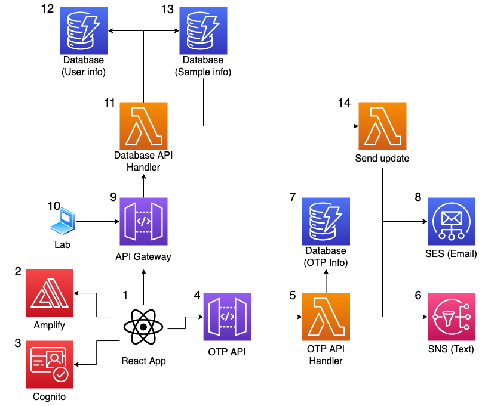
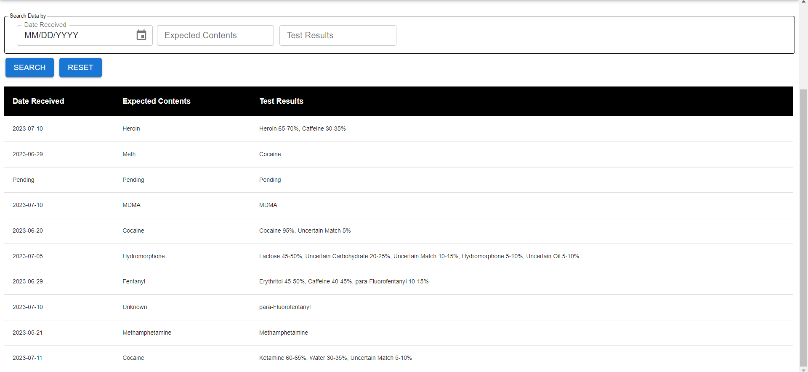
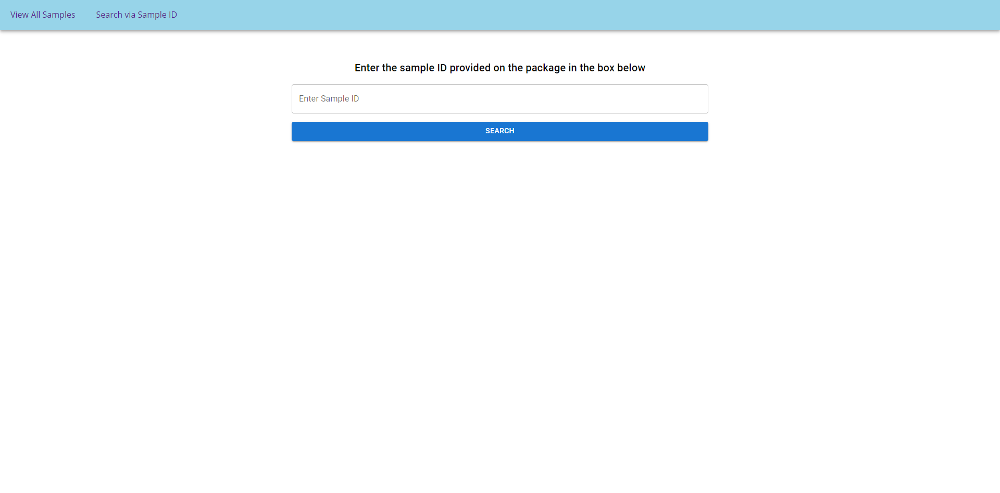
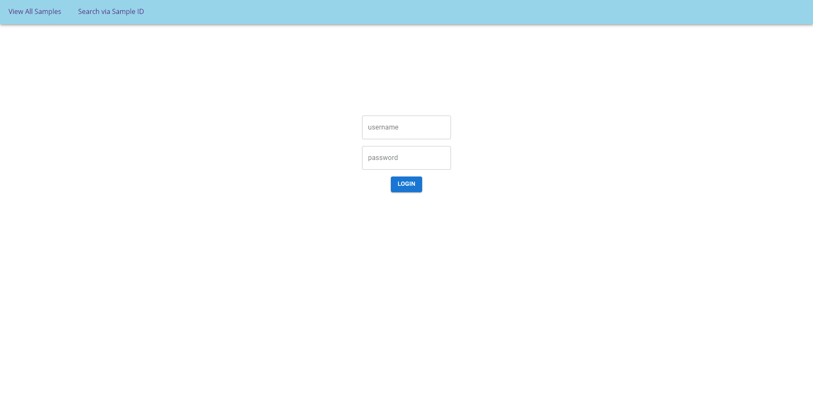
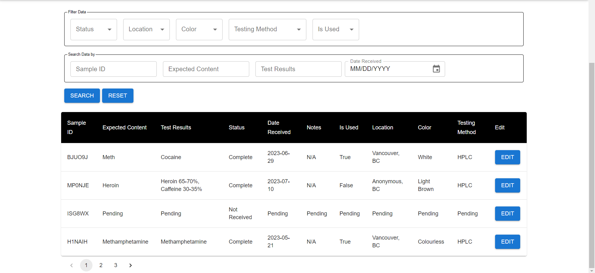

# Harm Reduction Web App

In collaboration with the UBC CIC, the Hein Lab (UBC Chemistry) developed a solution using AWS services to build awareness of harm reduction by posting the certainty of tested drug safeness on a public table. The process builds off from the Hein lab. In this way, the Hein lab uses a dropbox, where the student drops off the drug sample while understanding that their privacy is maintained if they opt out of providing contact information. Next, once the sample is obtained and prepared, the Hein lab’s robot records drug samples, tracks the sample as it undergoes testing, and the solution prototype developed by the CIC activates– results of the sample are posted to the public for viewing. With the help of cloud technology, resource capacity is solved, and the data is easily accessible and retrievable for future review and revision. 

|Index| Description|
|:---------------------------------------------------|:---------------------------------------------------------|
| [Stack Overview](#stack-overview)                  | The technologies powering the project.                   |
| [High Level Architecure](#high-level-architecture) | High level overview illustrating component interactions  |
| [Screenshots](#screenshots)                        | View screenshots of the application.                     |
| [Deployment](#deployment-guide)                    | Learn how to deploy this project yourself.               |
| [User Guide](#user-guide)                          | Learn how to use this application.                       |
| [License](#license)                                | License details.                                         |

## Stack Overview

The solution is a web application, which allows users (students/lab admins) to make various interactions and queries to the database in the backend. Testing results from the robot in the lab is automatically uploaded to the storage in the cloud via an API endpoint. students are able to check the status of a specific sample by searching via sample ID, as well as view basic information about all the samples that the lab has tested.

## High Level Architecture

The following architecture diagram illustrates the various AWS components utilized to deliver the solution.  

## Screenshots

### Home Page

### Public Table of Samples

### Searching via Specific Sample ID

### Admin Login Page

### Admin Table of Samples

## Deployment Guide

To deploy this solution, please follow our [Deployment Guide](./docs/deployment.md).

## User Guide

For instructions on how to use the web app, refer to the [User Guide](./docs/userguide.md).

## Credits

This application was architected and developed by Michael O'Keefe and Muhan Li, with guidance from the UBC CIC technical and project management teams.

## License

This project is distributed under the [MIT License](./LICENSE).
