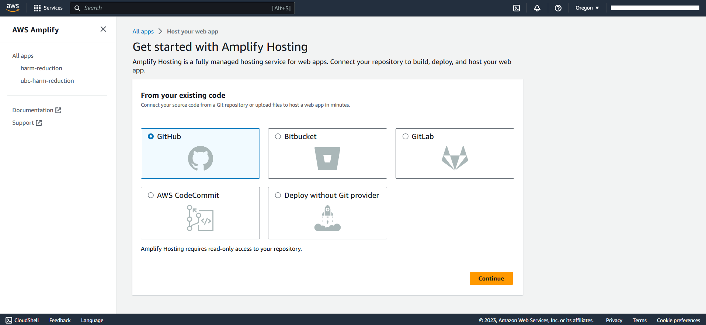
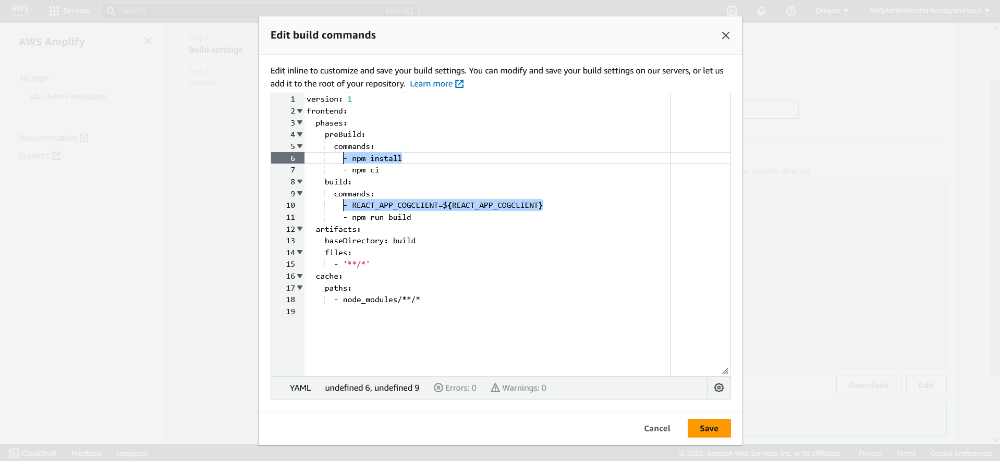
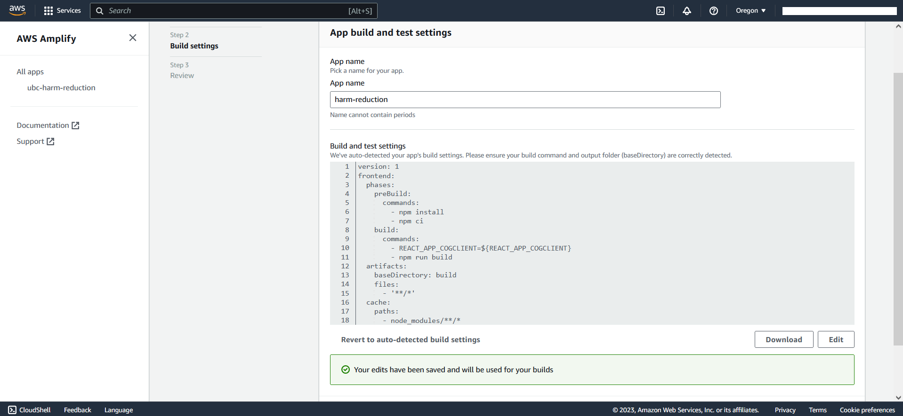
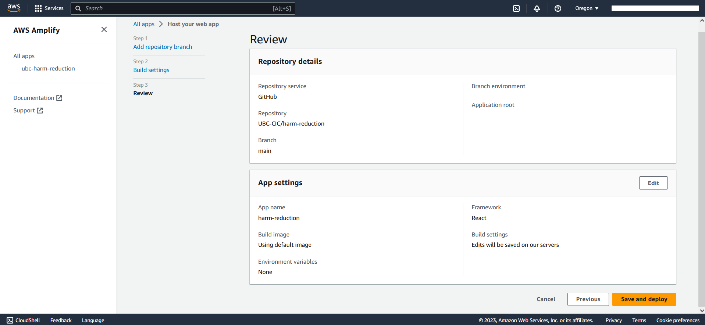
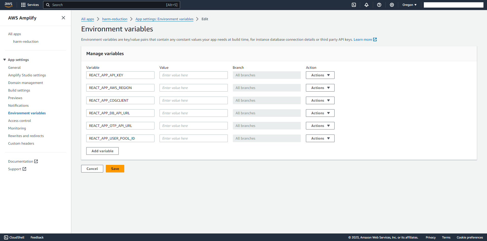
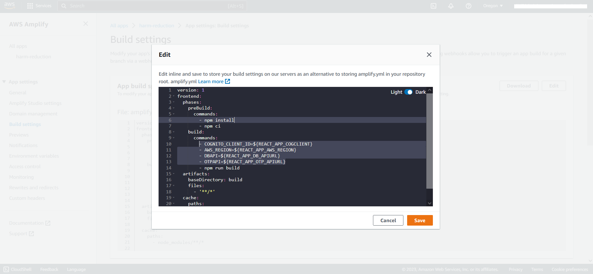
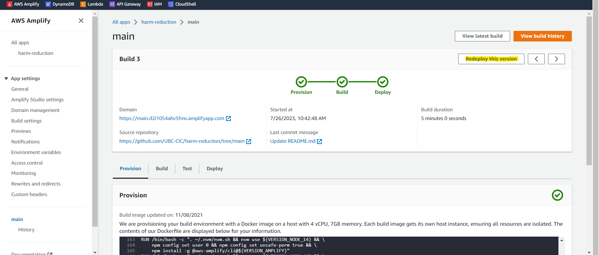

# Deployment Guide

## Requirements

Before you deploy, you must have the following in place:

* [AWS Account](https://aws.amazon.com/account/)
* [GitHub Account](https://github.com/)
* [AWS CLI](https://aws.amazon.com/cli/)

## Step 1: Clone The Repository

First, clone the github repository onto your machine. To do this:

1. Create a folder on your desktop to contain the code, for example: **harm-reduction**.
2. Open terminal (or command prompt if on windows) and **cd** into the above folder.
```bash
cd harm-reduction
```
3. Clone the github repository by entering the following:

```bash
git clone https://github.com/UBC-CIC/harm-reduction.git
```

## Step 2: Frontend Deployment
The **Deploy to Amplify Console** button will take you to your AWS console to deploy the front-end solution.

[](https://console.aws.amazon.com/amplify/home#/create)

1. On the AWS console. select your region on the top right, then select Github as your code source 
2. Select the repository named **harm-reduction**, then select the branch **main**, you may be prompted to authorize amplify to access your github account

3. In the box 'Build and test settings', make the following edits as pointed out below.  

4. Finally, click save and deploy to deploy the front end.

Congratulations, your front end is now deployed!

# Step 3: Backend Deployment

## Configure AWS CLI
Begin by configuring the AWS credentials by typing the following line in the CLI
```bash
aws configure
```
Please note that it is expected for your account to have administrator access for the steps in this deployment guide

## Deploy Backend 
Once the AWS CLI has been configured with the credentials, navigate to the directory named 'cdk' 
```bash
cd cdk
```
The 'cdk' directory contains the python files that describe how the AWS resources should be deployed using the CDK. 

Subdirectories under the directory '/cdk/lambda' each contain the code for the lambda functions that make up the majority of the backend

Run the following commands in the CLI to install the dependencies required for the CDK deployment
```bash
npm install -g aws-cdk
pip install -r requirements.txt
```

The next two commands will provision resources required to deploy the full stack (backend), and begin the deployment process.
```bash
cdk bootstrap
cdk deploy
```
## Delete / Cleanup
In order to delete the stack deployed in the step above, run the following command
```bash
cdk destroy
```

<!-- ## Configure Environmental Variables
Environmental variables on the Amplify deployment will provide information about the lambda functions that make up the backend. 

Start by navigating to the [CloudFormation console](https://us-west-2.console.aws.amazon.com/cloudformation/home?region=us-west-2#/).

Open the sidebar and navigate to the "stacks" section


The stack named "RecordWithFaceBlurStack" should be the first item in the list, click on it in order to display information about the deployed stack.


Select the tab named "resources"


Find the resources with "GetClip", "mp4stitch", "getsignedurl", and "videodata" in their names, copy the names of the lambda functions in the column "physical id", and paste them to the location described in the next 2 steps.


Now, navigate to the amplify console that you used in step 1 to deploy the frontend of the project. In the sidebar on the left, navigate to the "environmental variables" section. 
 -->

<!-- Click on manage variables, then add the five following variables
|Name|Value|
|----|-----|
|REACT_APP_AWS_REGION|paste name of your AWS region|
|REACT_APP_DB_APIURL|paste name of the DB API url here|
|REACT_APP_OTP_APIURL|paste name of the OTP API url here|

Once you have added the five variables, your screen should look something like the image below, click save to save your changes


Finally, navigate to the "build settings" section in the left sidebar. In the upper right corner of the box labeled "app build specification", click on the edit button to edit the build configuration. 


Click save to save your changes and exit the text editor. Then, go to your app, and click on the front end as shown in the image below.


In this menu, click on the button in the upper right corner labeled 'redeploy this version' in order for the updated environmental variables to take effect.
-->
# Step 4: Configure Environmental Variables

